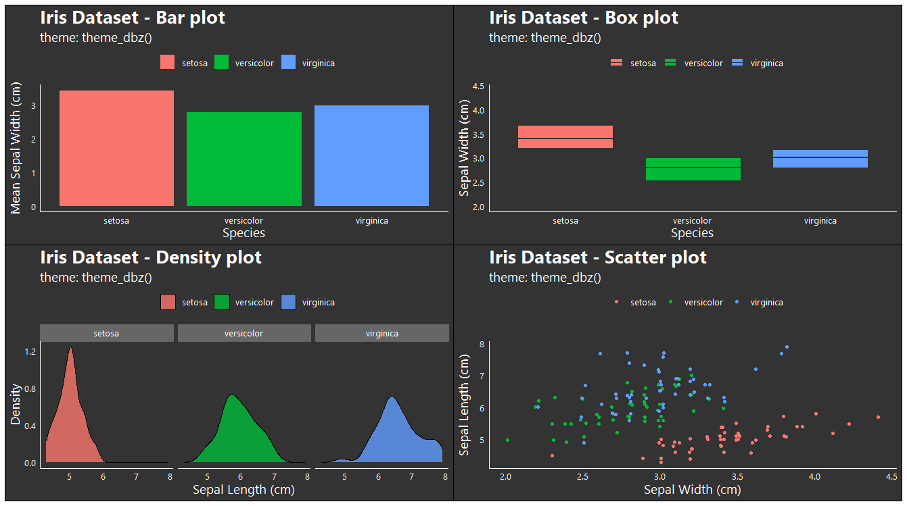
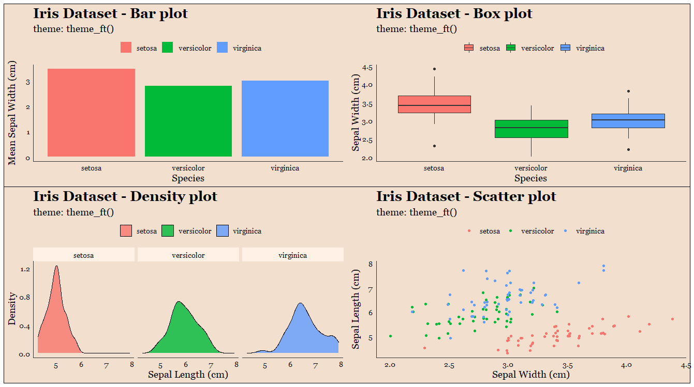
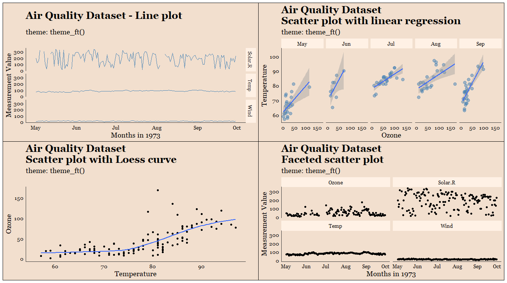

# 🎨 ggplot theme tester

## About

The aim of this project is to **create a workflow for designing and testing custom ggplot themes in R.** 

This project is for you if you are developing ggplot2 themes, or trying to figure out how a theme looks on a variety of plots (or a variety of themes on a plot). This project is built on the `purrr` workflow from this [blog post](https://martinctc.github.io/blog/vignette-generate-your-own-ggplot-theme-gallery/).

Sample output from `theme_executive()`:


---

### Pre-requisites

You don't need much to get started:

- {tidyverse} (essential) 
- {patchwork} (essential)
- RStudio (recommended)
- {extrafont} (recommended)

{extrafont} enables you to use a much wider range of fonts in your ggplots. If you have never initialised {extrafont} before, I recommend you to run the following lines of code. You'll only need to do this once:
```r
install.packages("extrafont")

extrafont::font_import()
loadfonts(device = "win")
```
This process of loading the fonts can take around 5 minutes, but I assure you it is well worth it.<sup>1</sup> After the process is completed, you will just need to load the {extrafont} library with `library(extrafont)` to use the desired fonts in ggplot.

---
### Workflow Basics

You can get started by cloning this repository, using GitHub Desktop or cloning it the traditional way using git. Open the `.Rproj` file in the main directory with RStudio, and open/save your scripts in the `scripts` folder (Don't use `setwd()`!).<sup>2</sup>

1. Load {tidyverse} and {extrafont} to ensure all ggplot2 features and fonts are available in the design and testing process.

2. Use `source()` to load in the pre-built ggplot objects from the `base_plots` folder. These are basically simple plots created with {ggplot2} to be used for designing and testing the themes you are creating. You can create more complicated base ggplots for testing if you prefer.

3. Create your ggplot theme as a function, and save the R file under "themes". In the main script, use `source()` again to load in the theme you've created. 

4. Run the test function to iterate through how your theme would look like with different base plot configurations. In this workflow, I use {patchwork} to combine the plots for easy viewing.

---

### Quick Example

Here is an example using the `theme_dbz()` theme that I used on the plots from my blog post [Data cleaning with Kamehamehas in R](https://martinctc.github.io/blog/data-cleaning-with-kamehamehas-in-r/):

```r
library(tidyverse)
library(patchwork)
library(extrafont)

#### Load base plots ####
source("base_plots/base_plots.R")

#### Design theme ####
source("themes/theme_dbz.R")

#### test themes ####
test_themes <- function(plots,
                        theme,
                        theme_label){
  plots +
    theme +
    labs(subtitle = theme_label)
  
}

#### Run plots ####

base_plots %>%
  map(test_themes,
      theme = theme_dbz(),
      theme_label = "theme: theme_dbz()") %>%
  reduce(`+`)

```

And here is the result:



---

### Theme Gallery

I am using this project for my personal use in developing themes. Please feel free to explore the themes that I am working on: 

#### FT Theme (`theme_ft()`)





#### Executive Theme (`theme_executive()`)


#### Dark DBZ Theme (`theme_dbz()`)


#### Economist Theme (`ggthemes::theme_economist()`)

You can also apply this workflow to themes in existing packages. Here is the Economist theme from {ggthemes}


---

<sup>1</sup>. For more information on the installation process, please see this Stack Overflow thread: https://stackoverflow.com/questions/34522732/changing-fonts-in-ggplot2

<sup>2</sup> See https://martinctc.github.io/blog/rstudio-projects-and-working-directories-a-beginner's-guide/.
